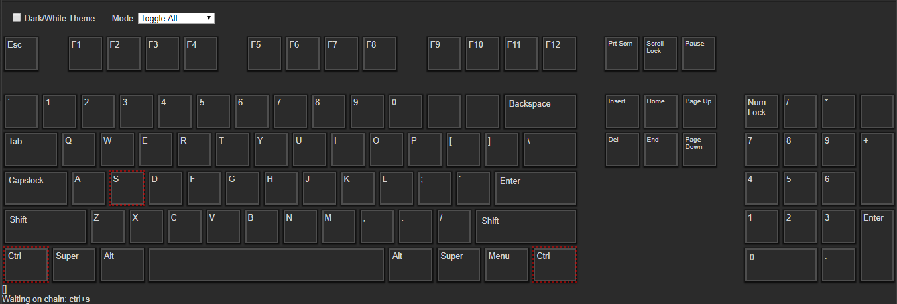

# shortcut-visualizer

This is WIP.

I prefer to use a custom set of keyboard shortcuts for most of my programs, but for some, there's just soooo many shortcuts to think about, that it's super hard to plan these out. My idea is to create a keyboard shortcut visualizer/organizer that lets you preview them similar to how this [project](http://waldobronchart.github.io/ShortcutMapper/) does it, but that also allows you to easily customize them (through drag/drop and/or a list) similar to how Adobe Premiere now lets you edit keyboard shortcuts (except even that implementation is still super clunky).

Eventually it would be nice to support some way to import/export them, at least for the most popular programs.

## Status/TODOs



- [x] Responsive Keyboard CSS
- [ ] Responsive Text Size
- [x] Base Key Object
- [x] Flexible Layout
- [x] Simple Key Detection
- [x] Toggle Options
- [ ] Colors
- [x] Chained Shortcuts / Shortcut Chords (e.g. VS Code you can do `Ctrl+K Ctrl+[` where `Ctrl+K` just adds a listener to `Ctrl+[` which then triggers a command)
- [x] Shortcut List
- [x] Show Active Shortcuts
- [x] Editing shortcuts
- [ ] Show active shortcuts on top of keys.
- [~] Custom Modifier Keys (e.g. use Tab as a modifier, or disable Shift, like for a text editor)
- [ ] Program Contexts
- [ ] Drag/Drop Bin w/ Search
- [ ] Polishing
- [ ] Demo
- [ ] Documentation
- [ ] Custom Remaps (e.g. Capslock = Ctrl + Alt + Shift)
- [ ] Package as a proper vue component.
- [ ] Figure out some way to make this a standalone library or include easily in a non-vue app?
- [ ] Tests...

# Notes 

- Print Screen only fires on keyup so it has a timeout to set it off.
- Caps/Scroll/Num Locks are `toggle: true` by default.
- `toggle: true` overrides input mode.
- If input mode is `toggle-modifers`, the modifiers that will toggle are: Ctrl, Shift, Alt. To add more (e.g. `tab`), set the key to `toggle: true`
- The names of the keys do not matter so long as the identifier is correct (`e.code`). `e.keycode` isn't used because I found it inconsistent (`Enter == NumpadEnter`). `e.code` can also differentiate between L/R.
   - So the keys object keys can be changed to anything you want, as can the text, etc, and it only matters what those are named for the layout, it's the identifier that's being listened to to actually set the active classes.
- Any key that shouldn't be ignored (e.g. blank keys just to fill layout) should not set a label property.
- Shortcuts are matched against a list created from the key's label text. All lowercase, no spaces, empty names are discarded. Can be overridden by setting a name property.
   - In a few rare cases this might be slightly confusing, specifically the super or oskey who's identifier is MetaRight/Left, while meta is sometimes shown on keyboard layouts where the menu key is. And I think meta is something else on macs?

## Build Setup

Based on Vue's Webpack Template

``` bash
# install dependencies
npm install

# serve with hot reload at localhost:8080
npm run dev

# build for production with minification
npm run build

# build for production and view the bundle analyzer report
npm run build --report

# run unit tests
npm run unit

# run e2e tests
npm run e2e

# run all tests
npm test
```
