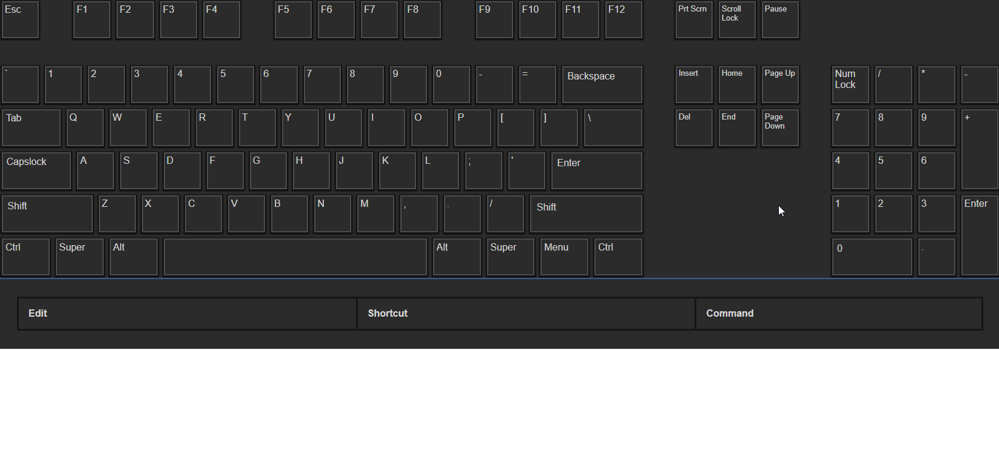

# shortcut-visualizer

This is WIP. It's almost ready for beta!

I prefer to use a custom set of keyboard shortcuts for most of my programs, but for some, there's just soooo many shortcuts to think about, that it's super hard to plan these out. My idea is to create a keyboard shortcut visualizer/organizer that lets you preview them similar to how this [project](http://waldobronchart.github.io/ShortcutMapper/) does it, but that also allows you to easily customize them (through drag/drop and/or a list) similar to how Adobe Premiere now lets you edit keyboard shortcuts (except even that implementation is still super clunky).

Eventually it would be nice to support some way to import/export them, at least for the most popular programs.

## Status

### Current State


Okay the contexts was a terrible example to show editing suggestions, but you get the idea. You can also drag commands from the list to any of the bins, and at some point dragging between the keyboard and list will be possible.

### Todos
- [x] Responsive Keyboard CSS
- [x] Responsive Text Size
- [x] Responsive Everything (relative to window only)
- [x] Base Key Object
- [x] Flexible Layout
- [x] Simple Key Detection
- [x] Toggle Options
- [x] Colors
- [x] Chained Shortcuts / Shortcut Chords (e.g. VS Code you can do `Ctrl+K Ctrl+[` where `Ctrl+K` just adds a listener to `Ctrl+[` which then triggers a command)
- [x] Shortcut List
- [x] Show Active Shortcuts
- [x] Editing shortcuts
- [x] Adding/Deleting Existing Shortcuts
- [x] Show active shortcuts on top of keys.
- [x] Custom Modifier Keys (e.g. use Tab as a modifier, or disable Shift, like for a text editor)
- [x] Program Contexts
- [x] Drag/Drop
- [x] Drag/Drop Commands
- [x] Del Bin
- [x] Unify Dragging Handlers
- [x] Split props up.
- [x] Allow handling of changed options.
- [x] Emit changes up to parent.
- [x] Properly block singles when editing list.
- [x] Separate warnings properly into component.
- [x] Rework helpers to mixin.
- [x] Split list contexts so individual contexts can be dragged.
- [x] Hide options when editing on input focus change.
- [x] Don't allow dragging while editing.
- [ ] Check css for things that should be variables, also fix borders variable.
- [ ] Check all modes work.
- [~] Polishing/Clean/Beta
- [ ] Have shortcuts contain all shortcuts, marking binned as binned, and assigning each an index property, so no more different indexes per type.
- [ ] Delete bin stopped working?
- [~] Demo
- [~] Documentation
- [ ] Tests...

Possible future changes/features/ideas:
- [ ] Confirmation for Batch Deletes
- [ ] Local Storage in Demo
- [ ] Proper Keyboard Accesibility?
- [ ] Command Search
- [ ] Full Command Bin (without going through list first to create entry)
- [ ] Command context restrictions.
- [ ] Mouse Commands
- [ ] Custom Remaps (e.g. Capslock = Ctrl + Alt + Shift)
- [ ] Per Context Blocks?
- [ ] Proper exporting (so you can just include a script to use the component).
	I considered switching to a template that supports this, but did not like any of them. I'm currently waiting for vue-cli 3, hopefully it'll make this a lot easier.

# Notes 

- Print Screen only fires on keyup so it has a timeout to set it off.
- Caps/Scroll/Num Locks need to be `toggle: true`.
- `toggle: true` overrides input mode.
- `modifiers_order` should just contain the character names of the keys (e.g. "Super", "Ctrl", etc) not the identifier.
- The names of the keys do not matter so long as the identifier is correct (`e.code`). `e.keycode` isn't used because I found it inconsistent (`Enter == NumpadEnter`). `e.code` can also differentiate between L/R.
   - So the keys object keys can be changed to anything you want, as can the text, etc, and it only matters what those are named for the layout, it's the identifier that's being listened to to actually set the active classes.
- Shortcuts are matched against a list created from the key's character property. All lowercase, no spaces, empty names are discarded. Can be overridden by setting a name property.
   - In a few rare cases this might be slightly confusing, specifically the super or oskey who's identifier is MetaRight/Left, while meta is sometimes shown on keyboard layouts where the menu key is. And I think meta is something else on macs?
- Although it might technically be possible to allow a key to be dragged, then change the keys being pressed, this seems to break dragula. To avoid the bugs and not make the code more complex, input is frozen on all dragging.
- Character property cannot be a space, if you want to hide a character (like space) it must be done through css.
- Some shortcuts are not overridable (e.g. in chrome Ctrl+W will close the tab, you cannot preventDefault it).

## Managing State

Because:
	- Some options need to be modified internally by the component to work.
	- Deep watching for prop changes from the component would be expensive.
	- Letting the component modify them would probably make it not work with vuex and is bad practice generally.
	- You might also want to keep these options in sync without triggering a change.

...`keys_list` and `shortcuts_list` will not trigger any changes by default.

UNLESS you call the component's `refresh_options` function. You can do this by setting a ref property for the component then calling `this.$refs.insert_your_ref_name.refresh_options([array of options keys to change])`. This will make the component recalculate the variables it uses internally that would usually only get created once on init. `keys_list` will also make `shortcuts_list` re-calculate but not the other way around.

Now after inits or refreshes, the component will fire a "ready" event with a deep clone of the internal shortcuts list it creates (it adds any missing chain starts, etc). This is so you can keep your state in sync from then on (with the "change" events the component emits). OR if you don't care about immediate changes (e.g. the user clicks a `save/confirm` changes button) see Fetching Directly below.

The keys_list also gets modified, hence why you need to call `refresh_options` if you change it, but you don't need to keep it in sync since it's just filling in missing properties just the once for internal use.

I have not completely tested this (e.g. with Vuex) but it should not cause any problems since the parent should not be able to modify the component's data and vice-versa. They both have their own copies of the `shortcuts_list` and the `keys_list`. And change events always send deep clones of the entries.

### Fetching Directly

If you don't care about immediate changes (e.g. the user clicks a `save/confirm` changes button) you can deep clone the data yourself only when you want.

To do this you can use one of the component's internal methods as it should be faster than something like _.cloneDeep because the structure of entries is known and there's no typeof checks to deep clone everything. For example:

```js
	let deep_clone_entry = this.$refs.shortcut_visualizer.deep_clone_entry
	let shortcuts = this.$refs.shortcut_visualizer.shortcuts
	this.data = shortcuts.map(entry => deep_clone_entry(entry))
```

### Change Events

The component will emit a change with {entries, type}, the entries (array) are deep cloned before they're sent and they should all contain an index property telling you were it is in the array. In the case of deletes, where it was. In the case of new entries, they should have an index to where they were placed. Event types are:

`deleted` - was dragged to delete bin or deleted from the shortcut list or the bin - is spliced from array internally
The following two might contain multiple entries when a chain start was dragged
`moved_to_bin` - was moved to the bin - gets marked as binned and added holder property, everything else stays the same
`moved_to_shortcuts` - was moved from bin to shortcuts - binned property made false, holder property might still exist*, everything else stays the same
`edited` - entry was edited (manually or through dragging/swapping), might fire a couple of times one after the other (e.g. you drag to/from a chain start). Would recommend replacing the entries in your array by splicing at their index properties (e.g. `for (let entry of entries) {you_shortcuts_array.splice(entry.index, 1, entry)}`)).

## Regarding Options

To allow you to do things like toggle the theme by toggling the options, you must handle option changes, for this an "options" event if emitted with a [key, value] array. If you want you can hide the options component completely from the user (with `options_dev.hide_options`) and only expose the options you like.

# Documentation Snippets

## Keys Format
```javascript
   menu: { //keyname for layout
      identifier: "", //event.code used to identify which key pressed
      name: "menu", //do not specify right or left
      character: "Menu", //label text
      classes:["key", "modifiers"], //classes for layout
      label_classes: [], //classes for key labels
      RL: false, //if a key like Shift which is on both sides
      is_modifier: false, //whether a key is treated as a modifier
      ignore: false, //whether it's not really a key, and just a key for the layout
      block_alone: true, //a shortcut cannot contain just blocked alone keys //useful for whether to block dragging to it, e.g. a command can't be set to just ctrl, and typing in shortcuts like just "ctrl+shift"
      block_single: false, //whether to allow the key to be included in a shortcut if it's the only modifier key (e.g. Shift + somekey for editiors), does nothing if the key isn't a modifier
      block_all: true, //whether to allow the key to be included in a shortcut at all(e.g. Ctrl + Menu or if menu was a modifier Ctrl + Menu + somekey)
      nokeydown: false, //whether the keydown event does not fire e.g. Print Screen doesn't fire a keydown, almost everything else does
      toggle: false, //whether it's a native toggle key (so we can use event.getModifierState to get real state)
      fake_toggle: //emulate key as toggle, overrides input mode
      active: false, //internal property needed by program
      chain_active: false, //internal property needed by program
   }
```

The keymap function then creates a keymap from the keys for use internally. It excludes ignored keys, filling in any empty properties and changing the format to: 

```javascript
   [identifier]: {
      //properties
   }
```

# Code Notes

- Since contexts and keys arrays are always sorted, quickest way to compare them if needed is to join them to a string.

## Build Setup

Based on Vue's Webpack Template

``` bash
# install dependencies
npm install

# serve with hot reload at localhost:8080
npm run dev

# build for production with minification
npm run build

# build for production and view the bundle analyzer report
npm run build --report

# run unit tests
npm run unit

# run e2e tests
npm run e2e

# run all tests
npm test
```

# Tests

I'm not sure really how to even approach the testing. Everything feels like an edge case and a lot of data needs to be injected for the component to work. To make this a bit more manageable I've started to keep a list of tests that should be made, at the very least to be able to test them manually and also just figure out how some edge cases should work. Then slowly I will convert them to real tests, because they are needed. It's far too easy to cause something to regress, especially when editing. 

1. When adding a shortcut: 
	1. Users should not be allowed to replace an existing shortcut.
	2. They can write a chained shortcut so long as it doesn't already exist. If it's chain start didn't exist it should get created.
	3. They can write a chain start and it won't get auto-delete upon creation.
2. When editing an existing shortcut:
	It's often important what the entry was just as much as what it was edited to. This is because editing is like dragging from the old entry to the new entry you wrote. This allows us to swap them when possible.
	1. You can change non-chained to an existing non-chained, they will get swapped.
	2. 2. above
	3. You can make a non-chained a chain start, if it conflicts they get swapped.
	4. You can't edit a chained shortcut into a chain start.
	5. You can make a chain start without dependents a non-chain.
3. While adding and editing:
	1. No dragging should be possible.
	2. No keyboard input should be possible.
4. The options. These are not that hard to check. Usually if they regress it's an issue of reactivity (the option wasn't specified in the demo's data so it's not reactive).
	1. Test for blurring input. This is most likely to actually regress. Note we can't have "some blur option" off then: edit => click away => "some blur option" on => click away, it won't work. 

