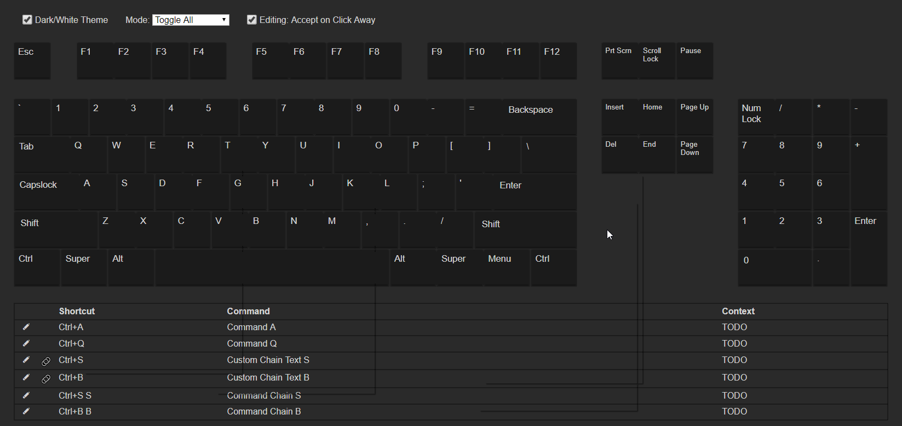

# shortcut-visualizer

This is WIP. It's almost ready for beta!

I prefer to use a custom set of keyboard shortcuts for most of my programs, but for some, there's just soooo many shortcuts to think about, that it's super hard to plan these out. My idea is to create a keyboard shortcut visualizer/organizer that lets you preview them similar to how this [project](http://waldobronchart.github.io/ShortcutMapper/) does it, but that also allows you to easily customize them (through drag/drop and/or a list) similar to how Adobe Premiere now lets you edit keyboard shortcuts (except even that implementation is still super clunky).

Eventually it would be nice to support some way to import/export them, at least for the most popular programs.

## Status

### Current State


Okay the contexts was a terrible example to show editing suggestions, but you get the idea. You can also drag commands from the list to any of the bins, and at some point dragging between the keyboard and list will be possible.

### Todos
- [x] Responsive Keyboard CSS
- [x] Responsive Text Size
- [x] Responsive Everything (relative to window only)
- [x] Base Key Object
- [x] Flexible Layout
- [x] Simple Key Detection
- [x] Toggle Options
- [x] Colors
- [x] Chained Shortcuts / Shortcut Chords (e.g. VS Code you can do `Ctrl+K Ctrl+[` where `Ctrl+K` just adds a listener to `Ctrl+[` which then triggers a command)
- [x] Shortcut List
- [x] Show Active Shortcuts
- [x] Editing shortcuts
- [x] Adding/Deleting Existing Shortcuts
- [x] Show active shortcuts on top of keys.
- [x] Custom Modifier Keys (e.g. use Tab as a modifier, or disable Shift, like for a text editor)
- [x] Program Contexts
- [x] Drag/Drop
- [x] Drag/Drop Commands
- [x] Del Bin
- [~] Polishing/Clean/Beta
- [x] Unify Dragging Handlers
- [ ] Split list contexts so individual contexts can be dragged?
- [ ] Allow passing command list to component.
- [ ] Mark Shortcut as Binned
- [ ] Local Storage in Demo
- [x] Properly block singles when editing list.
- [x] Separate warnings properly into component.
- [x] Rework helpers to mixin.
- [~] Demo
- [~] Documentation
- [ ] Tests...

Possible future features/ideas:
- [ ] Proper Keyboard Accesibility?
- [ ] Command Search
- [ ] Full Command Bin (without going through list first to create entry)
- [ ] Command context restrictions.
- [ ] Mouse Commands
- [ ] Custom Remaps (e.g. Capslock = Ctrl + Alt + Shift)
- [ ] Per Context Blocks?
- [ ] Proper exporting (so you can just include a script to use the component).
	I considered switching to a template that supports this, but did not like any of them. I'm currently waiting for vue-cli 3, hopefully it'll make this a lot easier.

# Notes 

- Print Screen only fires on keyup so it has a timeout to set it off.
- Caps/Scroll/Num Locks need to be `toggle: true`.
- `toggle: true` overrides input mode.
- `modifiers_order` should just contain the character names of the keys (e.g. "Super", "Ctrl", etc) not the identifier.
- The names of the keys do not matter so long as the identifier is correct (`e.code`). `e.keycode` isn't used because I found it inconsistent (`Enter == NumpadEnter`). `e.code` can also differentiate between L/R.
   - So the keys object keys can be changed to anything you want, as can the text, etc, and it only matters what those are named for the layout, it's the identifier that's being listened to to actually set the active classes.
- Shortcuts are matched against a list created from the key's character property. All lowercase, no spaces, empty names are discarded. Can be overridden by setting a name property.
   - In a few rare cases this might be slightly confusing, specifically the super or oskey who's identifier is MetaRight/Left, while meta is sometimes shown on keyboard layouts where the menu key is. And I think meta is something else on macs?
- Although it might technically be possible to allow a key to be dragged, then change the keys being pressed, this seems to break dragula. To avoid the bugs and not make the code more complex, input is frozen on all dragging.
- Character property cannot be a space, if you want to hide a character (like space) it must be done through css.
- Some shortcuts are not overridable (e.g. in chrome Ctrl+W will close the tab, you cannot preventDefault it).

# Documentation Snippets

## Keys Format
```javascript
   menu: { //keyname for layout
      identifier: "", //event.code used to identify which key pressed
      name: "menu", //do not specify right or left
      character: "Menu", //label text
      classes:["key", "modifiers"], //classes for layout
      label_classes: [], //classes for key labels
      RL: false, //if a key like Shift which is on both sides
      is_modifier: false, //whether a key is treated as a modifier
      ignore: false, //whether it's not really a key, and just a key for the layout
      block_alone: true, //a shortcut cannot contain just blocked alone keys //useful for whether to block dragging to it, e.g. a command can't be set to just ctrl, and typing in shortcuts like just "ctrl+shift"
      block_single: false, //whether to allow the key to be included in a shortcut if it's the only modifier key (e.g. Shift + somekey for editiors), does nothing if the key isn't a modifier
      block_all: true, //whether to allow the key to be included in a shortcut at all(e.g. Ctrl + Menu or if menu was a modifier Ctrl + Menu + somekey)
      nokeydown: false, //whether the keydown event does not fire e.g. Print Screen doesn't fire a keydown, almost everything else does
      toggle: false, //whether it's a native toggle key (so we can use event.getModifierState to get real state)
      fake_toggle: //emulate key as toggle, overrides input mode
      active: false, //internal property needed by program
      chain_active: false, //internal property needed by program
   }
```

The keymap function then creates a keymap from the keys for use internally. It excludes ignored keys, filling in any empty properties and changing the format to: 

```javascript
   [identifier]: {
      //properties
   }
```

# Code Notes

- Since contexts and keys arrays are always sorted, quickest way to compare them is to join them to a string.

## Build Setup

Based on Vue's Webpack Template

``` bash
# install dependencies
npm install

# serve with hot reload at localhost:8080
npm run dev

# build for production with minification
npm run build

# build for production and view the bundle analyzer report
npm run build --report

# run unit tests
npm run unit

# run e2e tests
npm run e2e

# run all tests
npm test
```
